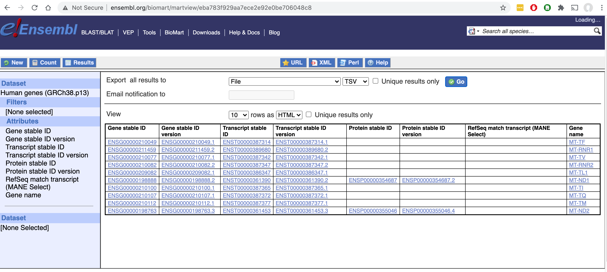

Contributing to Cool-Seq-Tool
=============================

Bug reports and feature requests
--------------------------------

Bugs and new feature requests can be submitted to the Cool-Seq-Tool `issue tracker on GitHub <https://github.com/genomicmedlab/cool-seq-tool/issues>`_. See `this StackOverflow post <https://stackoverflow.com/help/minimal-reproducible-example>`_ for tips on how to craft a helpful bug report.

Development Setup
-----------------
Clone the repository: ::

    git clone https://github.com/genomicmedlab/cool-seq-tool
    cd cool-seq-tool

Create a virtual environment and install :ref:`all dependency groups<dependency-groups>`: ::

    python3 -m venv venv
    source venv/bin/activate
    python3 -m pip install -e ".[dev,tests,docs]"

We use `pre-commit <https://pre-commit.com/#usage>`_ to run conformance tests before commits. This provides checks for:

* Code format and style
* Added large files
* AWS credentials
* Private keys

Before your first commit, run: ::

    pre-commit install

Style
-----

Code style is managed by `Ruff <https://github.com/astral-sh/ruff>`_, and should be checked via pre-commit hook before commits. Final QC is applied with GitHub Actions to every pull request.

Tests
-----

Tests are executed with `pytest <https://docs.pytest.org/en/7.1.x/getting-started.html>`_: ::

    pytest

Docstring code snippets are also runnable as doctests: ::

    pytest --doctest-modules src/

Documentation
-------------

The documentation is built with Sphinx, which is included in the ``docs`` dependency group. Navigate to the ``docs/`` subdirectory and use ``make`` to build the HTML version: ::

    # in an existing virtualenv environment
    python3 -m pip install -e '.[docs]'
    cd docs
    make html

See the `Sphinx documentation <https://www.sphinx-doc.org/en/master/>`_ for more information.

.. _build_transcript_mappings_tsv:

transcript_mappings.tsv
-----------------------

Cool-Seq-Tool uses a static copy of transcript mapping data acquired from `Ensembl BioMart <http://www.ensembl.org/biomart/martview>`_. To regenerate this file from the BioMart, select the ``Human Genes (GRCh38.p13)`` dataset and choose the following attributes:

* Gene stable ID
* Gene stable ID version
* Transcript stable ID
* Transcript stable ID version
* Protein stable ID
* Protein stable ID version
* RefSeq match transcript (MANE Select)
* Gene name

Alternatively, use `wags-tails <https://wags-tails.readthedocs.io/stable>`_:

.. code-block:: pycon

   >>> from wags_tails import EnsemblTranscriptMappingData
   >>> data_fetcher = EnsemblTranscriptMappingData()
   >>> data, version = data_fetcher.get_latest()
