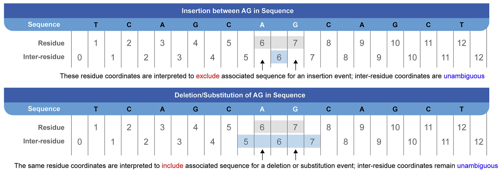

Using cool-seq-tool
===================

The core ``cool-seq-tool`` class provides three main methods: :ref:`transcript to genomic coordinates conversion <tr-to-g>`, :ref:`genomic to transcript coordinates conversion <g-to-tr>`, and :ref:`FASTA generation for a reference sequence <generate-fasta>`. This section provides an overview and describes basic procedures for each method.

.. note::

   Coordinate conversion methods are defined as ``async``, making use of Python's `coroutines library <https://docs.python.org/3/library/asyncio-task.html>`_. This means they must be ``await``\ ed. Users working in IPython or Jupyter should also see the `relevant documentation <https://ipython.readthedocs.io/en/stable/interactive/autoawait.html>`_ for more information.

Initialization
--------------

The ``CoolSeqTool`` class can be initialized with no arguments to use default locations for all data sources:

.. code-block:: python

   from cool_seq_tool import CoolSeqTool
   cst = CoolSeqTool()

When used in an environment that contains existing Gene Normalizer and SeqRepo instances, those instances can be passed directly to the initialization method to reuse them:

.. code-block:: python

   from cool_seq_tool import CoolSeqTool
   from cool_seq_tool.paths import SEQREPO_ROOT_DIR
   from biocommons.seqrepo import SeqRepo
   from gene.query import QueryHandler
   from gene.database import create_db as create_gene_db

   reusable_gene_normalizer = QueryHandler(create_gene_db())
   reusable_seqrepo = SeqRepo(SEQREPO_ROOT_DIR)
   cst = CoolSeqTool(
       gene_query_handler=reusable_gene_normalizer,
       sr=reusable_seqrepo
   )

See the :py:meth:`__init__ <cool_seq_tool.app.CoolSeqTool.__init__>` method documentation for more information and default argument values.

.. _tr-to-g:

Inputs
------

Residue and inter-residue coordinates
+++++++++++++++++++++++++++++++++++++

Genomic coordinates can be declared either as `residue-` or `inter-residue-based`. The former indicates that the value ``1`` denotes the first position in the sequence; in the latter case, position values refer to the spaces `between` bases, with position ``0`` referring to the space before the first base. By default, provided genomic coordinates are assumed to be residue-based (although this can be toggled with the ``residue_mode`` parameter), but returned coordinates are inter-residue-based.

   Fig.: Illustration of residue versus inter-residue coordinates in the context of insertions and deletions in a sequence (Hart et al. 2021).

See the `Variation Representation Schema (VRS) paper <https://www.sciencedirect.com/science/article/pii/S2666979X21000343>`_ for an explanation of our preference for inter-residue coordinates in the context of genomic variation.

.. _gene-input:

Gene names
++++++++++

Gene symbols are used to match candidate transcript accessions to those provided by the :ref:`Universal Transcript Archive <uta-data>`, which is annotated with `HGNC gene symbols <https://www.genenames.org/>`_. When given a gene term argument, the coordinate conversion methods will :ref:`normalize <gene-norm-data>` it, and the HGNC symbol corresponding to that normalized identity is then matched against UTA annotations. In practice, this means that previous/deprecated symbols or non-HGNC terms can be used, but HGNC symbols and identifiers are recommended to ensure maximal accuracy.

Transcript to genomic coordinates
---------------------------------

.. TODO is this a correct description of why the `gene` arg can be provided?

Given a transcript and starting and/or ending exons (and offsets), retrieve the corresponding genomic location. The ``transcript`` argument is required, and should be a RefSeq transcript identifier (e.g. ``"NM_002529.3"``). In addition, at least one of ``exon_start`` and ``exon_end`` should be given as integers, referring to the `i`\ th exon from that transcript accession (1-indexed, i.e. ``0`` is not a legal ``exon_start`` value). Additionally, genomic coordinate offsets can be passed for both start and end positions. Finally, if known, a gene symbol can be given to ensure that the most accurate transcript equivalence is used.

For example, the following chunk retrieves genomic coordinates bounding exons 1 through 5 on the transcript ``NM_004333.4`` (from the BRAF gene):

.. code-block:: pycon

   >>> from cool_seq_tool import CoolSeqTool
   >>> cst = CoolSeqTool()
   >>> result = await cst.transcript_to_genomic_coordinates(transcript="NM_004333.4",
   ...                                                      exon_start=1, exon_end=5)
   >>> result.genomic_data.chr
   'NC_000007.14'
   >>> result.genomic_data.start
   140924764
   >>> result.strand
   -1

Note that provided genomic coordinates are given as :ref:`inter-residue <residue-mode>`.

When rendered as a Python Dictionary, the returned object is structured as follows:

.. code-block::

   { 'genomic_data': { 'chr': 'NC_000007.14',
                       'end': 140807959,
                       'exon_end': 5,
                       'exon_end_offset': 0,
                       'exon_start': 1,
                       'exon_start_offset': 0,
                       'gene': 'BRAF',
                       'start': 140924764,
                       'strand': -1,
                       'transcript': 'NM_004333.4'},
     'service_meta': { 'name': 'cool_seq_tool',
                       'response_datetime': datetime.datetime(2023, 7, 6, 9, 29, 47, 359864),
                       'url': 'https://github.com/GenomicMedLab/cool-seq-tool',
                       'version': '0.1.14-dev0'},
     'warnings': []}

See the :py:meth:`transcript_to_genomic_coordinates <cool_seq_tool.app.CoolSeqTool.transcript_to_genomic_coordinates>` method API page for more information.

.. _g-to-tr:

Genomic to transcript coordinates
---------------------------------

``cool-seq-tool`` can also perform conversions in the other direction, retrieving a preferred transcript and exon coordinates given genomic location data. The required ``chromosome`` argument accepts either an integer chromosome number (using ``23`` and ``24`` for the X and Y chromosomes, respectively) or a complete RefSeq identifier (e.g. ``NC_000024.10``). A starting and/or an ending genomic position is also required. Finally, either a gene symbol and/or a transcript accession identifier must be provided. When only given a gene, the most preferred transcript (i.e. MANE transcript, if available) will be fetched, per the :ref:`transcript-policy`; if a transcript is given, then exon coordinates matching that transcript are returned, regardless of policy preference. In the process, liftover is performed to convert provided genomic coordinates to GRCh38, if necessary.

For example, the following chunk fetches the MANE Select transcript and corresponding exon coordinates for genomic position (140730665, 140924800) on the BRAF gene:

.. code-block:: pycon

   >>> from cool_seq_tool import CoolSeqTool
   >>> cst = CoolSeqTool()
   >>> result = await cst.genomic_to_transcript_exon_coordinates(
   ...     chromosome=7,
   ...     start=140730665,
   ...     end=140924800,
   ...     gene="BRAF"
   ... )
   >>> result.genomic_data.exon_start
   18
   >>> result.genomic_data.exon_start_offset
   1
   >>> result.genomic_data.transcript
   'NM_004333.6'

When rendered as a Python dictionary, the returned object is structured as follows:

.. code-block::

   { 'genomic_data': { 'chr': 'NC_000007.14',
                       'end': 140924694,
                       'exon_end': 1,
                       'exon_end_offset': -129,
                       'exon_start': 18,
                       'exon_start_offset': 1,
                       'gene': 'BRAF',
                       'start': 140734769,
                       'strand': -1,
                       'transcript': 'NM_004333.6'},
     'service_meta': { 'name': 'cool_seq_tool',
                       'response_datetime': datetime.datetime(2023, 7, 7, 8, 33, 49, 990337),
                       'url': 'https://github.com/GenomicMedLab/cool-seq-tool',
                       'version': '0.1.14-dev0'},
     'warnings': []}

The ``residue_mode`` parameter can be used to specify that provided coordinates are inter-residue, rather than residue-based (see :ref:`below <residue-mode>`):

.. code-block:: pycon

   >>> from cool_seq_tool import CoolSeqTool
   >>> cst = CoolSeqTool()
   >>> res_result = await cst.genomic_to_transcript_exon_coordinates(
   ...     7,
   ...     start=140730665,
   ...     gene="BRAF",
   ...     residue_mode="residue"  # default value
   ... )
   >>> (res_result.genomic_data.exon_start, res_result.genomic_data.exon_start_offset)
   (18, 1)
   >>> ir_result = await cst.genomic_to_transcript_exon_coordinates(
   ...     7,
   ...     start=140730665,
   ...     gene="BRAF",
   ...     residue_mode="inter-residue"
   ... )
   >>> (ir_result.genomic_data.exon_start, ir_result.genomic_data.exon_start_offset)
   (18, 2)

See the :py:meth:`genomic_to_transcript_exon_coordinates <cool_seq_tool.app.CoolSeqTool.genomic_to_transcript_exon_coordinates>` method API page for more information.

.. _generate-fasta:

FASTA generation
----------------

Generate a FASTA file for a reference sequence given its identifier. Sequence data is provided by :ref:`SeqRepo <seqrepo-data>`.

.. code-block:: python

   from cool_seq_tool import CoolSeqTool
   from pathlib import Path
   cst = CoolSeqTool()
   cst.get_fasta_file("NM_002529.3", Path(".") / "ntrk1_transcript.fasta")

.. _residue-mode:
